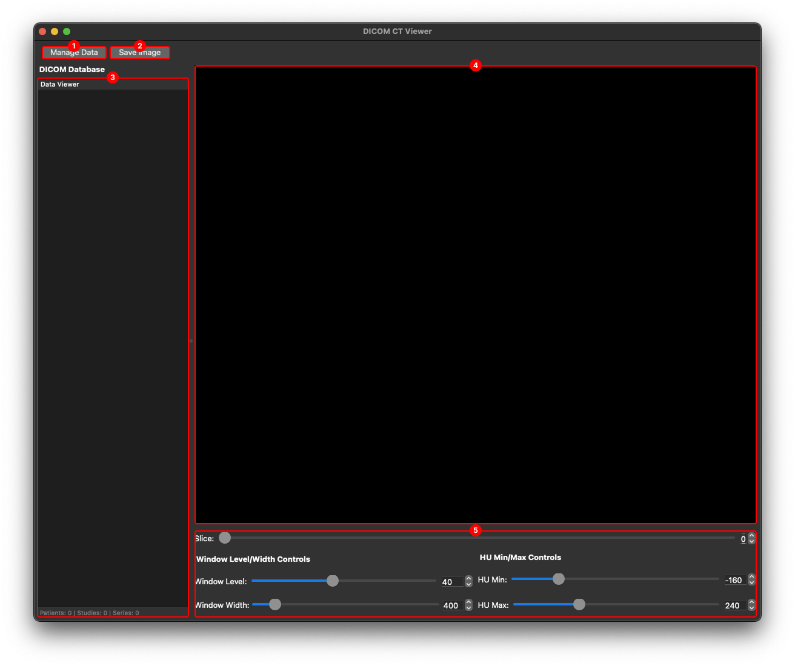
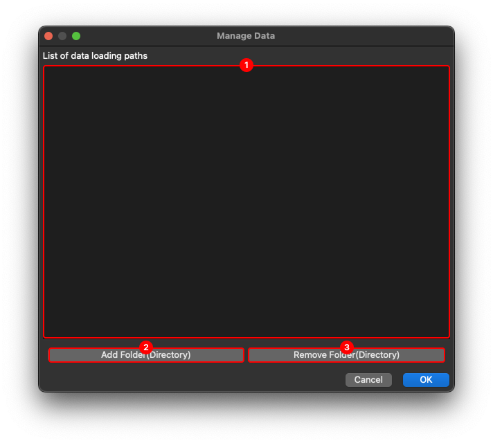
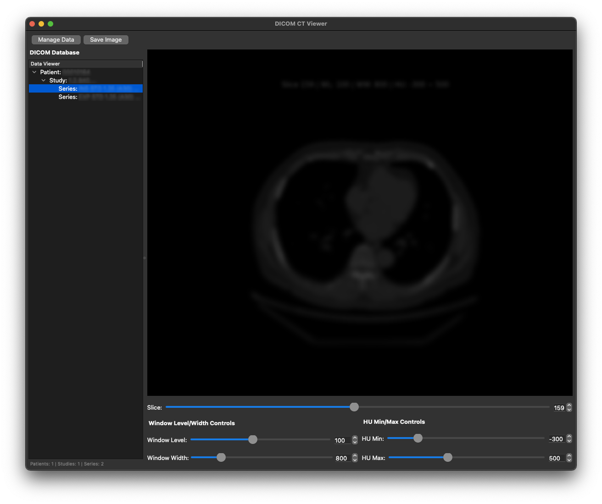

# DCMViewer

DICOM 파일을 불러와 데이터베이스를 구성하고, CT 영상의 Window Level/Width를 변경하며 볼 수 있는 기능을 제공합니다.

## Intsallation

프로그램 실행을 위해 아래 스크립트로 실행 환경을 설치합니다.

```bash
conda create -n dcmviewer python=3.9 -y
conda activate dcmviewer
pip install -r requirements.txt
```

## Run

프로그램 실행을 위해 아래 명령어를 실행합니다.

```bash
python app.py
```

## Build

프로그램을 단일 실행파일로 빌드하기 위해 아래 명령어를 실행합니다.

### Windows

윈도우 환경에서 `DCMViewer`를 빌드하기 위해 아래 명령어를 실행합니다.
빌드된 실행 파일은 `dist/dcmViewer-win.exe`에 위치합니다.

```ps
.\build_win.ps1
```

### MacOS

맥 환경에서 `DCMViewer`를 빌드하기 위해 아래 명령어를 실행합니다.
빌드된 실행 파일은 `dist/dcmViewer-mac.app`에 위치합니다.

```bash
bash build_mac.sh
```

## User Manual

### Main Screen

프로그램 메인 화면입니다.

**구성요소**

1. 데이터 관리 버튼: 데이터를 불러올 폴더/디렉토리를 설정할 수 있습니다(아래 그림 참고)
2. 이미지로 저장 버튼: 현재 슬라이스를 이미지(PNG)로 저장합니다.
3. 데이터 목록: 데이터 관리에서 설정한 폴더/디렉토리 내의 dicom 파일의 메타데이터를 확인하여 "환자번호-스터디-시리즈"로 구성된 트리를 제공합니다. 트리에서 시리즈 클릭 시, 해당 시리즈에 포함된 슬라이스를 4. 플라이스 표시부에 시각화합니다.
4. 슬라이스 표시부: 현재 슬라이스에 5. 윈도잉 조절부에서 설정한 설정값을 반영하여 시각화합니다.
5. 윈도잉 조절부: Window Level/Width를 조절하여 하거나 HU Min/Max를 조절하여 CT 영상의 특정 영역의 명암 및 대비를 조절합니다. (Window Level/Width 와 Hu Min/Max는 연동되어 동작합니다.)



### Sub Screen

데이터를 불러오는 경로를 관리하는 화면입니다.

_이 창에서 제어되는 폴더/디렉토리는 `dataPath.txt` 파일에 기록되며, 프로그램 실행 시 저장된 경로에서 자동으로 데이터를 불러옵니다._

**구성요소**

1. 폴더/디렉토리 목록: 데이터를 불러올 폴더/디렉토리 목록의 경로가 표시됩니다.
2. 폴더/디렉토리 추가: 데이터를 불러올 폴더/디렉토리를 추가합니다.
3. 폴더/디렉토리 삭제: 1. 폴더/디렉토리 목록에 존재하는 폴더/디렉토리 중 원하는 항목을 제거합니다.



### Example

| 본 이미지에서 환자 정보 및 영상은 블러처리 되어있습니다.


