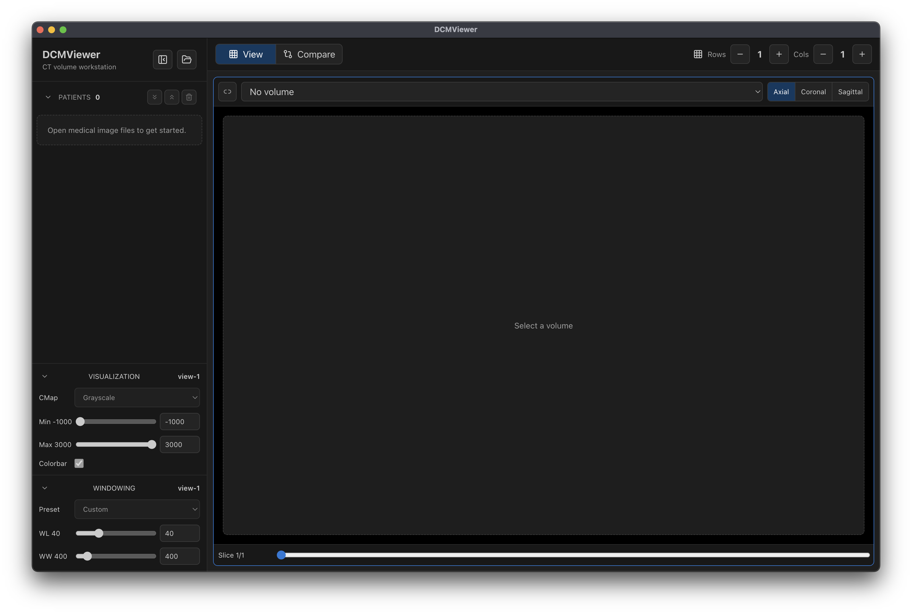
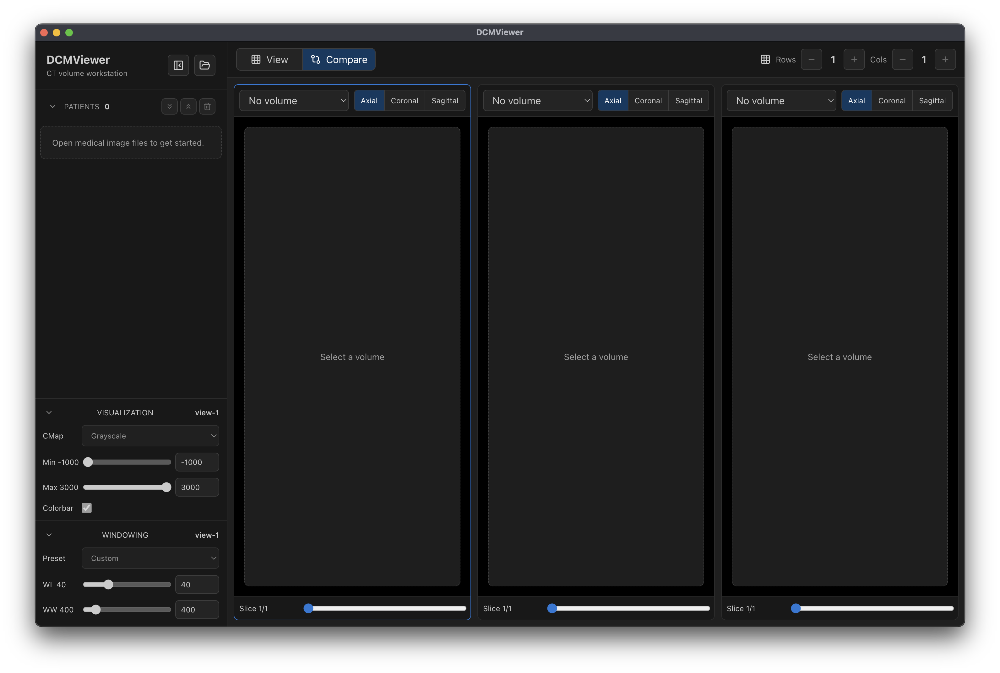

<p align="center">
	
</p>

# DCMViewer

DCMViewer는 CT 볼륨 파일을 불러와 슬라이스 단위로 확인하고, 여러 케이스를 동시에 비교할 수 있는 Electron 기반 데스크톱 뷰어입니다. DICOM 시리즈뿐 아니라 NIfTI와 NPY 볼륨도 함께 다룰 수 있도록 React, TypeScript, Vite, Electron으로 구성되어 있습니다.

## Screenshots

### Volume Viewer



### Compare Mode



## Features

- `.dcm`, `.dicom`, `.nii`, `.nii.gz`, `.npy` 파일 로드
- 파일 또는 폴더 선택 후 지원 형식 파일 자동 수집
- 환자 ID와 Study 기준으로 정렬되는 파일 트리
- Axial, Coronal, Sagittal 축 전환
- 슬라이스 탐색 및 Window Level, Window Width 조절
- row/column을 조절할 수 있는 멀티뷰 그리드
- 1 row, 3 column 비교 모드
- 비교 모드에서 두 케이스의 차이 볼륨 표시
- 비교 모드의 slice, axis, WL/WW 동기화

## Tech Stack

- Electron 31
- React 18
- TypeScript
- Vite 5
- dicom-parser
- nifti-reader-js
- lucide-react

## Getting Started

### Requirements

- Node.js 20.10 이상
- npm

현재 프로젝트는 Node.js 20.10 환경에서 빌드 확인되었습니다.

### Install

```bash
npm install
```

### Run in Development

```bash
npm run dev
```

개발 모드에서는 Vite 개발 서버가 `http://127.0.0.1:5173/`에서 실행되고, Electron 앱이 해당 화면을 로드합니다.

### Lint

```bash
npm run lint
```

### Build

```bash
npm run build
```

빌드 결과는 다음 위치에 생성됩니다.

```text
dist/
dist-electron/
```

### Package Desktop App

unpacked directory 형태로 앱을 확인하려면 다음 명령을 실행합니다.

```bash
npm run dist
```

macOS 설치 패키지를 생성하려면 다음 명령을 실행합니다.

```bash
npm run dist:mac
```

Windows 설치 패키지를 생성하려면 다음 명령을 실행합니다.

```bash
npm run dist:win
```

패키징 결과물은 `release/` 아래에 생성됩니다. macOS target은 `dmg`, `zip`이며 Windows target은 `nsis`, `zip`입니다. Windows 패키지는 Windows 환경에서 실행하는 것을 권장합니다. macOS에서 Windows 패키지를 cross-build하려면 `electron-builder`가 요구하는 Wine 등 추가 도구가 필요할 수 있습니다.

## Usage

1. 앱을 실행합니다.
2. 좌측 상단의 폴더 열기 버튼 또는 상단의 `Open` 버튼을 누릅니다.
3. CT 영상 파일이나 폴더를 선택합니다.
4. 좌측 파일 트리에서 환자와 Study를 펼칩니다.
5. 볼륨을 클릭하면 현재 활성화된 뷰포트에 표시됩니다.
6. 각 뷰포트에서 축, slice, WL, WW를 조절합니다.
7. 멀티뷰가 필요하면 상단의 Rows, Cols 컨트롤로 그리드를 조절합니다.
8. 두 케이스를 비교하려면 `Compare`를 활성화하고 우측 패널에서 Case 1, Case 2를 선택합니다.

## Compare Mode

비교 모드는 1 row, 3 column 레이아웃으로 동작합니다.

- 첫 번째 뷰: Case 1
- 두 번째 뷰: Case 2
- 세 번째 뷰: Case 2 - Case 1 차이 볼륨

비교 모드에서는 축, 슬라이스, Window Level, Window Width 값이 모든 뷰에 동기화됩니다. 차이 볼륨은 두 볼륨의 width, height, depth가 모두 같을 때만 생성됩니다.

## Supported Formats

### DICOM

- 일반적인 비압축 픽셀 데이터 DICOM을 지원합니다.
- 같은 환자, Study, Series 단위로 슬라이스를 묶어 3D 볼륨을 구성합니다.
- Patient ID, Study Instance UID, Series Instance UID를 우선 사용합니다.
- JPEG, JPEG-LS, JPEG2000 등 압축 DICOM은 아직 지원하지 않습니다.

### NIfTI

- `.nii`, `.nii.gz` 파일을 지원합니다.
- `nifti-reader-js`에서 지원하는 주요 numeric datatype을 Float32 볼륨으로 변환합니다.

### NPY

- 2D 또는 3D numeric NPY 파일을 지원합니다.
- C-order 배열을 지원합니다.
- Fortran-order NPY는 아직 지원하지 않습니다.

## Project Structure

```text
dcmViewer/
├── assets/                   # 앱 아이콘과 README 스크린샷
├── electron/
│   ├── main.ts               # Electron 메인 프로세스, 파일 선택 dialog, 파일 읽기
│   └── preload.ts            # Renderer에 안전하게 노출하는 preload API
├── src/
│   ├── components/
│   │   └── SliceViewport.tsx  # 캔버스 기반 슬라이스 뷰어
│   ├── loaders/
│   │   ├── dicom.ts          # DICOM 시리즈 파싱 및 볼륨 구성
│   │   ├── nifti.ts          # NIfTI 로더
│   │   ├── npy.ts            # NPY 로더
│   │   └── medicalLoader.ts  # 형식별 로더 통합, 스터디 트리, 차이 볼륨 생성
│   ├── App.tsx               # 전체 워크스테이션 UI
│   ├── rendering.ts          # 축별 슬라이스 추출 및 캔버스 렌더링
│   ├── types.ts              # 공통 타입
│   └── index.css             # 앱 스타일
├── package.json
└── vite.config.ts
```

## Development Notes

Renderer는 브라우저 보안 모델을 유지하고, 로컬 파일 접근은 Electron main process에서 처리합니다. 파일 선택 결과는 preload API인 `window.dcmViewer.openMedicalFiles()`를 통해 Renderer로 전달됩니다.

볼륨 데이터는 `Float32Array`로 정규화되며, 렌더링 시 WL/WW를 적용해 grayscale canvas image로 변환합니다.

## Roadmap

- 압축 DICOM codec 지원
- DICOM metadata 상세 패널
- Series별 정렬 기준 보강
- 윈도우 프리셋, 확대/이동, 거리 측정 도구
- 비교 모드에서 rigid/affine registration 연동
- Linux 패키징 설정 추가
