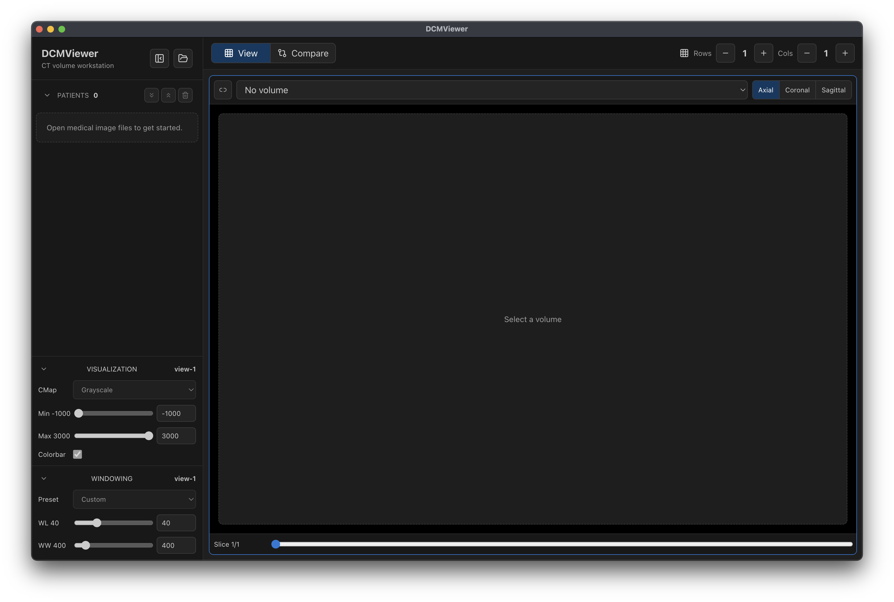
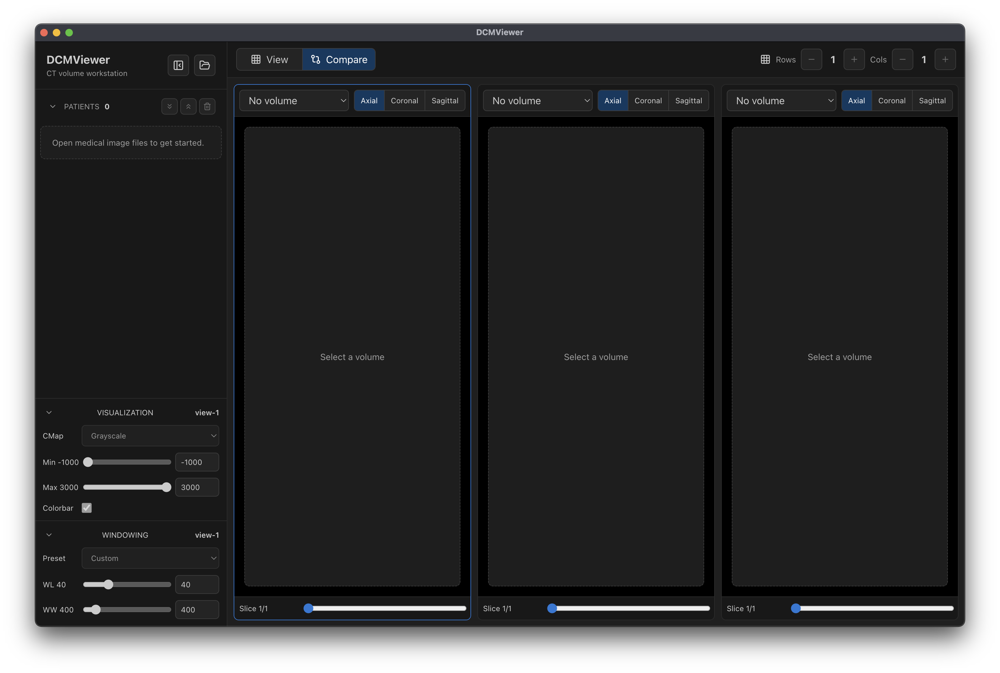

<p align="center">
	
</p>

# DCMViewer

DCMViewer는 CT 볼륨 파일을 불러와 슬라이스 단위로 확인하고, 여러 케이스를 동시에 비교할 수 있는 Electron 기반 데스크톱 뷰어입니다. DICOM 시리즈뿐 아니라 NIfTI와 NPY 볼륨도 함께 다룰 수 있도록 React, TypeScript, Vite, Electron으로 구성되어 있습니다.

## VS Code 확장 프로그램

동일한 뷰어를 VS Code 편집기 탭에서도 사용할 수 있습니다. DICOM/NIfTI/NPY 파일 열기, 폴더 단위 시리즈 로딩과 기존 멀티뷰·비교 기능을 지원합니다.

```bash
npm ci
npm ci --prefix vscode-extension
npm run package:vscode
```

`release/dcmviewer-2.0.5.vsix`를 VS Code의 **Extensions → … → Install from VSIX…**로 설치하세요. 파일을 클릭하거나 명령 팔레트의 **DCMViewer: Open Medical Folder / DICOM Series**로 폴더를 선택합니다. DICOM 파일 하나를 열면 해당 파일만 로드하므로 전체 시리즈는 폴더로 여세요.

개발 시 F5에서 **DCMViewer VS Code Extension** 구성을 실행합니다. 확장 빌드는 `npm run build:vscode`, 자동 테스트는 `npm run test:vscode`, 실제 VS Code 통합 테스트는 `npm --prefix vscode-extension run test:integration`입니다. 자세한 내용은 [확장 프로그램 README](./vscode-extension/README.md)를 참고하세요.

## Screenshots

### Volume Viewer



### Compare Mode



## Features

- `.dcm`, `.dicom`, `.nii`, `.nii.gz`, `.npy` 파일 로드
- 파일 또는 폴더 선택 후 지원 형식 파일 자동 수집
- 환자 ID와 Study 기준으로 정렬되는 파일 트리
- Axial, Coronal, Sagittal 축 전환
- 슬라이스 탐색 및 Window Level, Window Width 조절
- row/column을 조절할 수 있는 멀티뷰 그리드
- 1 row, 3 column 비교 모드
- 비교 모드에서 두 케이스의 차이 볼륨 표시
- 비교 모드의 slice, axis, WL/WW 동기화

## Tech Stack

- Electron 31
- React 18
- TypeScript
- Vite 5
- dicom-parser
- nifti-reader-js
- lucide-react

## Getting Started

### Requirements

- Node.js 20.10 이상
- npm

현재 프로젝트는 Node.js 20.10 환경에서 빌드 확인되었습니다.

### Install

```bash
npm install
```

### Run in Development

```bash
npm run dev
```

개발 모드에서는 Vite 개발 서버가 `http://127.0.0.1:5173/`에서 실행되고, Electron 앱이 해당 화면을 로드합니다.

### Lint

```bash
npm run lint
```

### Build

```bash
npm run build
```

빌드 결과는 다음 위치에 생성됩니다.

```text
dist/
dist-electron/
```

### Package Desktop App

unpacked directory 형태로 앱을 확인하려면 다음 명령을 실행합니다.

```bash
npm run dist
```

macOS 설치 패키지를 생성하려면 다음 명령을 실행합니다.

```bash
npm run dist:mac
```

Windows 설치 패키지를 생성하려면 다음 명령을 실행합니다.

```bash
npm run dist:win
```

패키징 결과물은 `release/` 아래에 생성됩니다. macOS target은 `dmg`, `zip`이며 Windows target은 `nsis`, `zip`입니다. Windows 패키지는 Windows 환경에서 실행하는 것을 권장합니다. macOS에서 Windows 패키지를 cross-build하려면 `electron-builder`가 요구하는 Wine 등 추가 도구가 필요할 수 있습니다.

## Usage

1. 앱을 실행합니다.
2. 좌측 상단의 폴더 열기 버튼 또는 상단의 `Open` 버튼을 누릅니다.
3. CT 영상 파일이나 폴더를 선택합니다.
4. 좌측 파일 트리에서 환자와 Study를 펼칩니다.
5. 볼륨을 클릭하면 현재 활성화된 뷰포트에 표시됩니다.
6. 각 뷰포트에서 축, slice, WL, WW를 조절합니다.
7. 멀티뷰가 필요하면 상단의 Rows, Cols 컨트롤로 그리드를 조절합니다.
8. 두 케이스를 비교하려면 `Compare`를 활성화하고 우측 패널에서 Case 1, Case 2를 선택합니다.

## Compare Mode

비교 모드는 1 row, 3 column 레이아웃으로 동작합니다.

- 첫 번째 뷰: Case 1
- 두 번째 뷰: Case 2
- 세 번째 뷰: Case 2 - Case 1 차이 볼륨

비교 모드에서는 축, 슬라이스, Window Level, Window Width 값이 모든 뷰에 동기화됩니다. 차이 볼륨은 두 볼륨의 width, height가 같을 때 생성됩니다. depth가 다르면 슬라이스의 상대 위치로 대응시켜 계산하며, 공간 정합은 수행하지 않습니다.

## Supported Formats

### DICOM

- 일반적인 비압축 픽셀 데이터 DICOM을 지원합니다.
- 같은 환자, Study, Series 단위로 슬라이스를 묶어 3D 볼륨을 구성합니다.
- Patient ID, Study Instance UID, Series Instance UID를 우선 사용합니다.
- JPEG, JPEG-LS, JPEG2000 등 압축 DICOM은 아직 지원하지 않습니다.

### NIfTI

- `.nii`, `.nii.gz` 파일을 지원합니다.
- `nifti-reader-js`에서 지원하는 주요 numeric datatype을 Float32 볼륨으로 변환합니다.

### NPY

- 2D, 3D 및 채널 우선 `(channel, depth, height, width)` 4D numeric NPY 파일을 지원합니다.
- C-order 배열을 지원합니다.
- Fortran-order NPY는 아직 지원하지 않습니다.

## Project Structure

```text
dcmViewer/
├── assets/                   # 앱 아이콘과 README 스크린샷
├── electron/
│   ├── main.ts               # Electron 메인 프로세스, 파일 선택 dialog, 파일 읽기
│   └── preload.ts            # Renderer에 안전하게 노출하는 preload API
├── src/
│   ├── components/
│   │   └── SliceViewport.tsx  # 캔버스 기반 슬라이스 뷰어
│   ├── loaders/
│   │   ├── dicom.ts          # DICOM 시리즈 파싱 및 볼륨 구성
│   │   ├── nifti.ts          # NIfTI 로더
│   │   ├── npy.ts            # NPY 로더
│   │   └── medicalLoader.ts  # 형식별 로더 통합, 스터디 트리, 차이 볼륨 생성
│   ├── App.tsx               # 전체 워크스테이션 UI
│   ├── rendering.ts          # 축별 슬라이스 추출 및 캔버스 렌더링
│   ├── types.ts              # 공통 타입
│   └── index.css             # 앱 스타일
├── package.json
└── vite.config.ts
```

## Development Notes

Renderer는 브라우저 보안 모델을 유지하고, 로컬 파일 접근은 Electron main process에서 처리합니다. 파일 선택 결과는 preload API인 `window.dcmViewer.openMedicalFiles()`를 통해 Renderer로 전달됩니다.

볼륨 데이터는 `Float32Array`로 정규화되며, 렌더링 시 WL/WW를 적용해 grayscale canvas image로 변환합니다.

## Roadmap

- 압축 DICOM codec 지원
- DICOM metadata 상세 패널
- Series별 정렬 기준 보강
- 윈도우 프리셋, 확대/이동, 거리 측정 도구
- 비교 모드에서 rigid/affine registration 연동
- Linux 패키징 설정 추가

## 영상 플립과 라벨 오버레이

각 뷰포트 상단의 **Flip left / right**, **Flip up / down** 버튼으로 화면을 좌우·상하 반전합니다. 영상과 라벨이 함께 반전되며 마우스 복셀 좌표는 원본 볼륨 좌표를 표시합니다. 연결된 뷰포트와 비교 모드에서는 플립 방향이 동기화됩니다.

1. 영상을 열고 라벨을 올릴 뷰포트를 선택합니다.
2. 좌측 **Label Overlay → Load label**에서 NIfTI (`.nii`, `.nii.gz`), NPY 또는 비압축 DICOM 마스크를 선택합니다. DICOM 라벨 시리즈는 폴더로 선택합니다.
3. 여러 마스크 또는 다채널 NPY를 불러왔으면 **Mask**에서 표시할 마스크를 선택합니다.
4. **Show overlay**, **Opacity**로 표시 여부와 투명도를 조절하고, **Remove label**로 제거합니다.

라벨 값은 비음수 정수여야 하며 **0은 투명한 배경**, 양의 정수는 클래스별 색상으로 표시됩니다. 영상과 라벨의 크기는 정확히 같아야 하며 축 순서·복셀 간격·공간 방향도 동일한 격자로 미리 맞춰야 합니다. 자동 정합이나 리샘플링은 수행하지 않습니다. 2D NPY는 깊이 1인 영상에, 4D NPY는 `(channel, depth, height, width)` 순서로 채널별 마스크를 불러옵니다. 각 라벨은 불러올 때 선택한 영상에 연결되며 다른 영상으로 전환하면 표시하지 않습니다.

렌더링 검증: 저장소 루트에서 `npm run test:rendering`.

## 탐색과 작업 흐름 개선 (v2.0.4)

- **확대·이동**: `+` / `−`, 확대 버튼 또는 Ctrl/⌘ + 휠로 25–800% 확대합니다. 좌클릭 드래그로 이동하고 **Fit image** / `0`으로 화면에 맞춥니다. 라벨과 복셀 좌표도 함께 이동합니다.
- **빠른 슬라이스 탐색**: 영상에 포커스를 둔 상태에서 방향키, Shift + 방향키(10장), Home/End로 탐색합니다. 하단 번호는 1부터 입력하며 Enter로 적용, Escape로 취소합니다.
- **단축키**: `H` / `V` 플립, `L` 라벨 표시 전환, `R` 뷰 초기화. **Controls**에서 조작법을 확인합니다. 텍스트 입력 중에는 영상 단축키가 적용되지 않습니다.
- **라벨 확인**: Fill/Outline 전환, 클래스별 표시/숨김과 전체 표시/숨김을 지원합니다. 클래스 필터는 뷰포트별로 유지됩니다.
- **파일 찾기**: 환자·Study·파일 이름·형식으로 검색합니다. 같은 볼륨 ID의 반복 로드는 중복 표시하지 않습니다.
- **비교**: 두 개 이상의 영상을 불러온 후 Compare를 선택하면 서로 다른 두 케이스를 기본 선택합니다. 깊이가 다른 영상은 상대 위치로 슬라이스를 연결하며, 라벨·확대 조작은 다른 뷰의 슬라이스를 움직이지 않습니다. 차이 영상은 비교 모드에서만 계산합니다.
- **작은 화면**: 폭이 900px 이하인 편집기에서는 뷰포트를 세로로 배치하고 스크롤합니다. 일반 멀티뷰도 최소 영상 공간을 확보하도록 스크롤할 수 있습니다.
- **오류 확인**: 일부 파일을 읽지 못해도 나머지를 불러옵니다. **Details**에서 모든 오류를 확인하고 ×로 안내를 닫을 수 있습니다.

개발 검증은 `npm run test:rendering`, `npm run test:vscode`, `npm run test:ui`로 실행합니다. UI 테스트는 Chrome이 필요하며 가상 영상과 라벨만 사용합니다. 다른 설치된 Chromium 계열 브라우저는 `DCMVIEWER_BROWSER_CHANNEL`로 지정할 수 있습니다. UI 테스트의 미리보기 실행과 브라우저 자동화 API는 [Playwright 공식 문서](https://playwright.dev/docs/api/class-browsertype)를 따릅니다.

## 원격 최초 로딩 최적화 (v2.0.5)

원격 호스트의 파일을 읽은 후 **ArrayBuffer 바이너리**로 전달합니다. Base64의 약 33% 크기 팽창을 제거하여, 압축하지 않아도 이전 Base64 payload보다 약 25% 작습니다. 파일 크기와 네트워크 프로토콜 오버헤드는 별도입니다.

- **선택적 무손실 압축**: 원격 실행 시 4 KiB 이상의 파일은 앞 64 KiB를 샘플링합니다. 압축 이득이 있으면 gzip level 1로 압축하고, 전체 압축 결과가 원본보다 5% 이상 작을 때만 전송합니다. `.nii.gz`는 다시 압축하지 않습니다. 영상·라벨의 원본 바이트는 그대로 복원되며 다운샘플링하지 않습니다.
- **묶음 요청**: 최대 8개, 원본 크기 합계 8 MiB 이하의 파일을 한 번에 요청합니다. 큰 단일 볼륨은 별도로 요청합니다. 서버는 파일 두 개씩 읽고 압축해 동시 작업 수를 제한하며, 파일별 오류를 개별 반환합니다.
- **탭 내 메모리 캐시**: 복원된 파일을 최대 64 MiB까지 LRU 방식으로 보관합니다. 같은 탭에서 파일을 다시 선택할 때 서버에서 조회한 수정 시각·크기가 같으면 재전송하지 않습니다. 파일 변경, 캐시 퇴출, 탭 닫기 후에는 다시 전송합니다. 파일 시스템이 변경 시각을 정확히 갱신하지 않는 환경에서는 탭을 닫고 다시 열어 새로 불러오세요. 디스크에 캐시를 저장하지 않습니다.
- **설정**: 서버 CPU 사용을 줄이고 싶으면 VS Code 설정의 `dcmviewer.compressRemoteFiles`를 끕니다. 로컬 실행에서는 gzip 전송 압축을 생략합니다.

원격 창에서 v2.0.5 VSIX를 설치하고 창을 다시 로드해 확장 호스트와 웹뷰의 버전을 함께 갱신하세요. 별도 서버 프로세스나 포트 설정은 필요하지 않습니다. 큰 단일 파일은 여전히 전체 파일을 전송·복원한 뒤 파싱하므로 전송 시간은 실제 파일 압축률과 회선 속도에 따라 달라집니다. 슬라이스 단위 스트리밍은 구현하지 않습니다.

전송 벤치마크는 `npm --prefix vscode-extension run benchmark:transfer`로 실행합니다. 가상 16비트 데이터에서 기존 Base64 21.33 MiB 대비 gzip 바이너리 약 10.31 MiB(약 52% 감소), 이미 gzip 압축된 데이터는 약 25% 감소를 확인했습니다. 작은 파일 300개는 각 묶음이 8 MiB 이하일 때 요청 수가 300회에서 38회로 줄어듭니다. 실제 의료영상이나 SSH 회선에서 측정한 속도는 아닙니다.

압축은 [Node.js zlib](https://nodejs.org/api/zlib.html), 웹뷰 복원은 [DecompressionStream](https://developer.mozilla.org/en-US/docs/Web/API/DecompressionStream)을 사용합니다.
